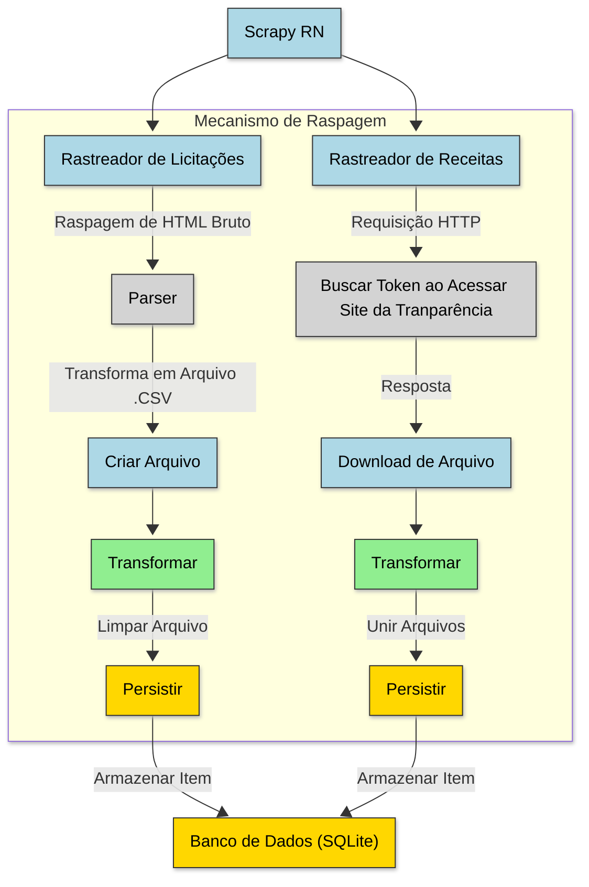

# INF0233-ScrapyRN
Uma ferramenta para extrair informações de licitações e receitas do estado do Rio Grande do Norte para a disciplina INF0243: Extração Automática de Dados da UFG.

## Funcionalidades

- Automação da extração, transformação e carregamento (ETL) de dados públicos do Rio Grande do Norte, sendo eles: licitações e receitas.        
- Persistência dos dados num banco de dados local.

## Tecnologias

 - Python 3, uma linguagem de programação de alto nível e de propósito geral;
 - Beautiful Soup, uma biblioteca para extrair dados de arquivos HTML e XML;
 - NumPy, uma biblioteca para cálculos númericos;
 - Pandas, uma biblioteca de análise e manipulação de dados;
 - Playwright, um framework para testes e automação na Web;
 - SQLite, uma biblioteca para ter acesso a banco de dados SQL sem executar um processo SGBD separado.

## Configuração do ambiente de desenvolvimento

1. Instale o python, na versão 3.10, através do [link](https://www.python.org/downloads/);
2. Instale o navegador do chrome através do [link](https://www.google.com/chrome/);
3. Clone este repositório https://github.com/anunciado/INF0233-ScrapyRN.git em sua máquina local;
4. Abra o projeto em sua IDE de preferência, como sugestão utilize o Visual Studio Code ou PyCharm;
5. Crie um ambiente virtual com o comando:
```
. python -m venv venv
```
6. Ative o ambiente virtual com o comando:
* No windows:
```
venv\Scripts\activate
```
* No linux:
```
source venv/bin/activate
```
7. Instale as bibliotecas no seu ambiente virtual a partir do arquivo _requirements.txt_ com o comando:
```
pip install -r requirements.txt
```
8. Instale o playwright com o comando:
```
playwright install
```
9. Execute o projeto com o comando:
```
python main.py
```

## Arquitetura Geral

Rastreador de Licitações / Rastreador de Receitas ➞ Transformação ➞ SQLite

1. **Rastreamento** – o mecanismo **Scrapy RN** possui dois rastreadores principais:
   - **Rastreador de Licitações**: Realiza raspagem de HTML bruto em páginas de licitações.
   - **Rastreador de Receitas**: Realiza requisições HTTP e busca token para acessar o site da transparência.

2. **Transformação** – os dados brutos são processados em arquivos CSV:
   - **Licitações** → Parser converte o HTML bruto em arquivo `.csv`.
   - **Receitas** → Realiza o download de arquivos com os dados das respostas.

3. **Limpeza e União** – arquivos são ajustados:
   - **Licitações** → Limpeza e padronização dos dados.
   - **Receitas** → União dos arquivos recebidos em um único arquivo processado.

4. **Persistência (SQLite)** – Cada item processado é salvo/atualizado no banco de dados **SQLite**, que serve como camada de armazenamento local.

## Diagrama Resumido da Pipeline



## Licença de uso e fontes dos dados

### Dados de Receitas

- **Fonte de Dados**: SIGEF - Sistema Integrado De Planejamento E Gestão Fiscal
- **Gestor**: Secretaria de Estado de Planejamento e Finanças - SEPLAN
- **Site**: [http://www.transparencia.rn.gov.br/receita](http://www.transparencia.rn.gov.br/receita)
- **Licença
  **: [Creative Commons Atribuição 4.0 Internacional (CC BY 4.0)](https://creativecommons.org/licenses/by/4.0/?ref=chooser-v1)

### Dados de Licitações  

- **Fonte de Dados**: Tabela de dados de Portal de Licitações do Governo do RN
- **Gestor**: Secretaria do Estado de Administração - SEAD
- **Site**: [servicos.searh.rn.gov.br/searh/Licitacao](http://servicos.searh.rn.gov.br/searh/Licitacao)
- **Licença**: Embora não possuam licença explícita, a transparência destes dados é assegurada pela Lei Complementar
  Estadual Nº 695, de 18 de janeiro de 2022, que atesta a transparência dos dados das receitas, gastos e ações públicas
  do Estado do Rio Grande do Norte. Documento disponível
  no [link](http://adcon.rn.gov.br/ACERVO/gac/DOC/DOC000000000278920.PDF).

### Uso dos Dados
Este projeto utiliza os dados exclusivamente para fins educacionais e de pesquisa acadêmica, respeitando os princípios de transparência e acesso à informação pública estabelecidos pela legislação vigente.

## Dataset Limpo

O projeto disponibiliza um dataset estruturado no arquivo [dados_rn.db](dados_rn.db), que contém os dados de licitações e receitas do estado do Rio Grande do Norte já processados e limpos. Este arquivo é um dump do banco de dados SQLite que armazena as informações coletadas e transformadas pelo sistema.

**Características do dataset:**
- **Formato:** SQLite Database (.db)
- **Conteúdo:** Dados de licitações e receitas públicas do RN
- **Status:** Processado e estruturado
- **Data de geração:** 19/06/2025

O banco de dados pode ser acessado diretamente através de qualquer cliente SQLite ou por meio de código Python utilizando a biblioteca `sqlite3`.

# Dicionário de Dados

### Dados de Saída de Receitas

| Nome do Campo              | Tipo de Dados | Descrição                                                                                                                                                                                                                                             | Exemplo                                             |
|----------------------------|---------------|-------------------------------------------------------------------------------------------------------------------------------------------------------------------------------------------------------------------------------------------------------|-----------------------------------------------------|
| Código                     | Texto         | Código vinculado a receita.                                                                                                                                                                                                                           | "1.1.1.8.01.2.1.01"                                 |
| Categoria                  | Texto         | Classificação detalhada da receita, dividida em duas, corrente e de capital.                                                                                                                                                                          | "Deduções da Receita"                               |
| Espécie                    | Texto         | Classificação vinculado à Origem que permite qualificar com maior detalhe o fato gerador dos ingressos das receitas. Por exemplo, dentro da Origem Receita Tributária, podemos identificar as espécies “impostos, taxas e contribuições de melhoria”. | "Impostos, Taxas e Contribuições de Melhoria"       |
| Rúbrica                    | Texto         | A Rubrica busca identificar dentro de cada Espécie de receita, uma  qualificação mais específica. Agrega determinadas receitas com características próprias e semelhantes entre si.                                                                   | "Impostos"                                          |
| Alínea                     | Texto         | Identifica o nome da receita propriamente dita, registrando a entrada de recursos financeiros.                                                                                                                                                        | "Impostos - Específicos de Estados/DF e Municípios" |
| Detalhamento               | Texto         | Nível mais analítico em relação a classificação da natureza da receita.                                                                                                                                                                               | IPVA                                                |
| Receita Prevista (Bruta)   | Numérico      | Registro dos valores da previsão inicial das receitas a serem arrecadadas em um ano e que devem constar na Lei Orçamentária Anual.                                                                                                                    | 100                                                 |
| Receita Arrecadada (Bruta) | Numérico      | É a arrecadação de fato do valor, que o torna disponível nos cofres públicos para uso pelo Ente Federativo.                                                                                                                                           | 100                                                 |
| Ano                        | Texto         | Ano que ocorreu a receita.                                                                                                                                                                                                                            | "2019"                                              |
| Mês                        | Texto         | Mes que ocorreu a receita.                                                                                                                                                                                                                            | "01"                                                |

### Dados de Saída de Licitações

| Nome do Campo  | Tipo de Dados | Descrição                                                                                       | Exemplo                                                    |
|----------------|---------------|-------------------------------------------------------------------------------------------------|------------------------------------------------------------|
| numero         | Texto         | Identificador único da licitação.                                                               | "20250001"                                                 |
| ano            | Texto         | Ano que ocorreu a licitação.                                                                    | "2019"                                                     |
| processo       | Texto         | Número do processo vinculado a licitação.                                                       | "5100270007492024"                                         |
| modalidade     | Texto         | Tipo de licitação conforme a legislação vigente (e.g., Pregão, Concorrência, Tomada de Preços). | "Pregão Eletrônico"                                        |
| objeto         | Texto         | Descrição sucinta do objeto da licitação.                                                       | "Aquisição de materiais de escritório"                     |
| situacao       | Texto         | Situação atual da licitação (e.g., Aberta, Em Andamento, Concluída, Cancelada).                 | "Aberta"                                                   |
| valor          | Numérico      | Valor efetivamente adjudicado ao vencedor da licitação.                                         | 14500000                                                   |
| orgao          | Texto         | Nome do orgão que realizou a licitação.                                                         | SEARH                                                      |
| link_edital    | URL           | Endereço eletrônico para acesso ao edital da licitação.                                         | "http://servicos.searh.rn.gov.br/edital/PE_01_2025.pdf"    |
| link_resultado | URL           | Endereço eletrônico para acesso ao resultado da licitação.                                      | "http://servicos.searh.rn.gov.br/resultado/PE_01_2025.pdf" |

## Análise de Dados

Uma análise exploratória completa dos dados extraídos está disponível em um notebook Jupyter hospedado no Google Colab:

🔗 **[Análise Exploratória dos Dados - RN](https://colab.research.google.com/drive/1yVFTeSyPSNSzcpiF32rTHaUkqgdIaNn1?usp=sharing)**

O notebook contém:
- **Exploração dos dados** de licitações e receitas
- **Visualizações interativas** dos principais indicadores
- **Análises estatísticas** dos valores e distribuições
- **Insights** sobre os padrões encontrados nos dados públicos
- **Gráficos e métricas** para compreensão dos dados coletados

Para executar a análise localmente, você pode fazer o download do notebook e executá-lo em seu ambiente Python com as dependências instaladas.

## Contribuição

1. `Mova` a issue a ser resolvida para a coluna _In Progress_ no [board do projeto].  
2. `Clone` este repositório https://github.com/anunciado/INF0233-ScrapyRN.git.
3. `Crie` um branch a partir da branch _dev_.
4. `Commit` suas alterações.
5. `Realize` o push das alterações.
6. `Crie` a solicitação PR para branch _dev_.
7. `Mova` a _issue_ da coluna _In Progress_ para a coluna _Code Review_ do [board do projeto].

## Desenvolvedores

- [Luís Eduardo](https://github.com/anunciado)